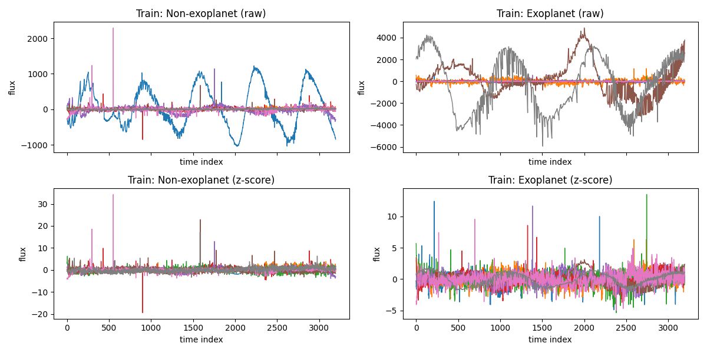
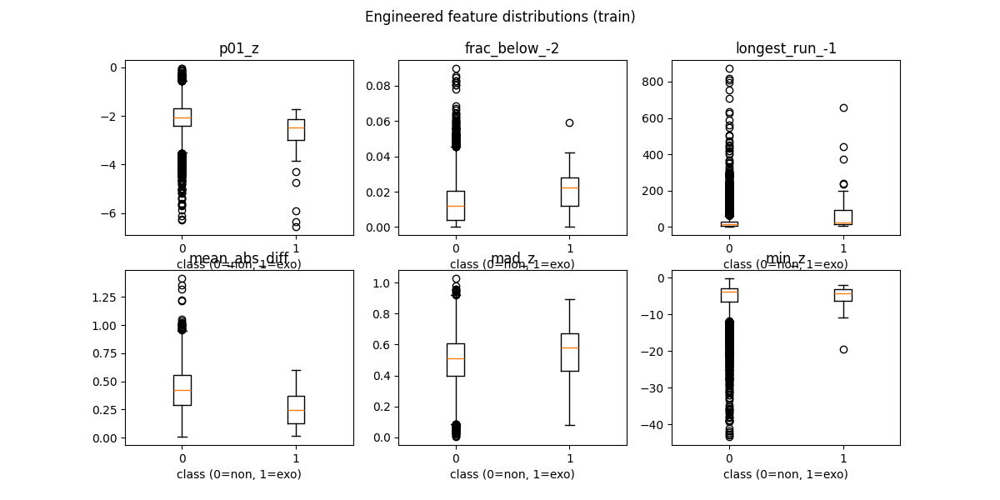
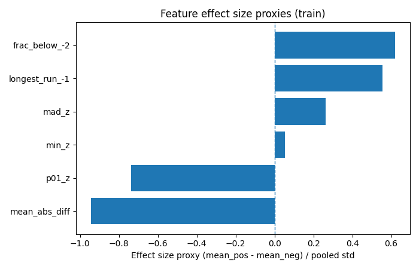
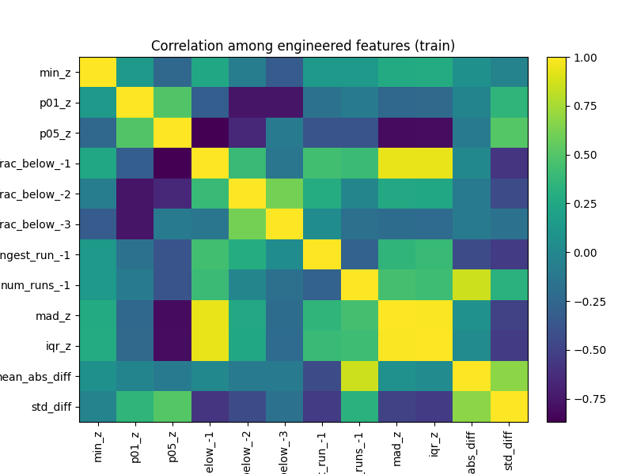
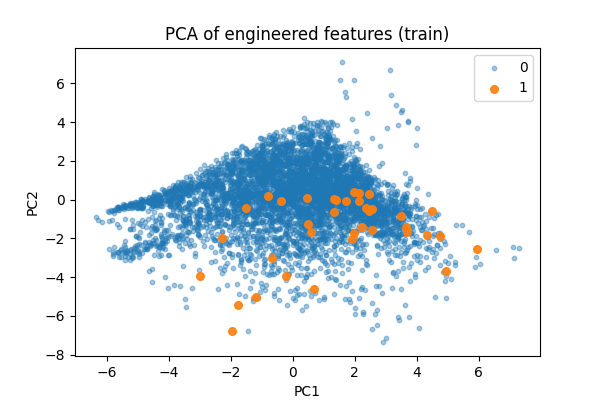
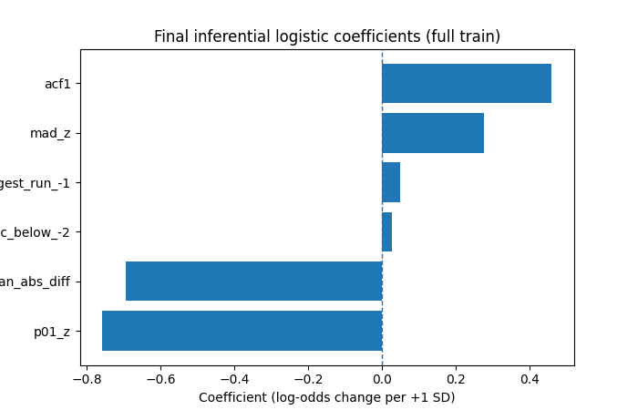
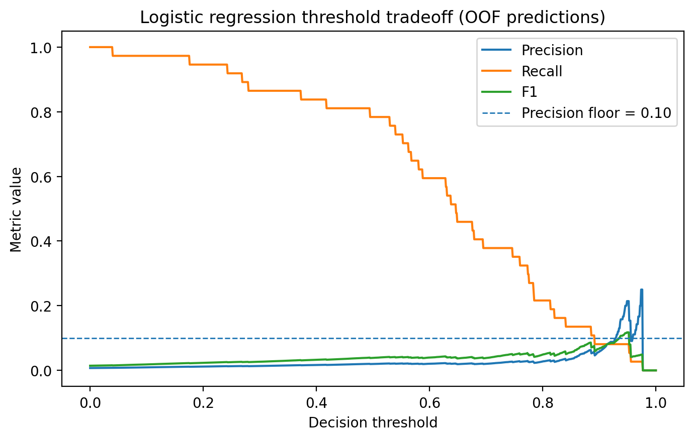



# Abstract

Detecting exoplanets from stellar light curves is a scientifically important problem and a difficult classification task. In the transit method, a planet passing in front of its host star causes a temporary drop in observed brightness, but in real data these drops can be small, noisy, and hard to distinguish from other sources of variability. In this project, we analyze a labeled Kepler light-curve dataset to answer two questions: which light-curve characteristics are most strongly associated with stars labeled as hosting exoplanets, and how well those stars can be identified under extreme class imbalance.

The dataset contains fixed-length stellar flux time series with 3,197 measurements per star and binary labels for exoplanet status. The positive class is very rare, with only 37 exoplanet-labeled stars in the training set and 5 in the test set. To make the light curves comparable across stars, we applied per-star z-score normalization and engineered interpretable features describing lower-tail dimming, dip frequency, dip duration, variability, and short-lag smoothness. We then carried out exploratory data analysis, feature selection, inferential logistic regression, and predictive model comparison using logistic regression, random forest, and gradient boosting. Because of the severe class imbalance, we evaluated performance primarily with precision-recall methods rather than accuracy.

The results show that the strongest and most consistent inferential signal is deeper lower-tail dimming, captured by the feature `p01_z`. Measures of local smoothness, including short-lag autocorrelation and mean absolute difference, also contributed useful but less stable information. For prediction, logistic regression outperformed both random forest and gradient boosting, suggesting that the engineered feature space is captured better by a simple linear decision boundary than by the tree-based models considered here. Even so, threshold analysis showed a severe precision-recall tradeoff: modest precision was only achievable at very low recall. Overall, the dataset contains real signal, but the rarity and heterogeneity of the positive class place clear limits on practical detection performance.

The full implementation code is available in the project repository [@becker2026-kepler-repo].

# Introduction

The discovery and characterization of exoplanets is a major problem in modern astronomy. One of the most common detection methods is the transit method, where a planet passes between its host star and the observer and causes a temporary dip in observed brightness [@nasa-transit]. In principle, those dips leave a measurable signature in a star’s light curve, and their depth, timing, and duration can provide useful physical information about the system [@nasa-lightcurve; @heller2019]. In practice, however, transit signals can be small, noisy, and difficult to separate from other forms of stellar variability or observational artifact. This makes exoplanet detection from light-curve data both scientifically important and statistically difficult.

This project analyzes a labeled Kepler light-curve dataset collected from a mission designed to detect exoplanets through high-precision photometric observations [@borucki2010]. Each star is represented by a fixed-length sequence of flux measurements and assigned a binary label for exoplanet status. Although the basic physical intuition is straightforward—stars with exoplanets should show dimming behavior—the data are not simple. The positive class is extremely rare, making up less than 1% of both the training and test sets, and the positive examples are not visually uniform. Some exoplanet-labeled light curves show clear or repeated low-flux dips, while others appear smoother or more irregular. Raw flux values also vary substantially across stars, so direct comparison is difficult without normalization.

Given these challenges, the project focuses on two related questions. The first is inferential: which engineered light-curve features are most strongly associated with exoplanet-labeled stars? The second is predictive: how well can those stars be identified under severe class imbalance? These questions overlap, but they are not the same. A feature may look useful in exploratory plots but contribute little once other variables are included in a multivariable model. Likewise, a model may rank observations reasonably well while still performing poorly as a practical classifier at a fixed decision threshold.

The analysis proceeds in several steps. Exploratory data analysis is first used to examine the structure of the dataset, compare raw and normalized light curves, and motivate a compact set of engineered features. Logistic regression is then used for inferential analysis, with attention to coefficient stability and conditional feature associations. Predictive performance is evaluated by comparing logistic regression, random forest, and gradient boosting under a fixed stratified cross-validation protocol, followed by threshold analysis of the best-performing model to study the precision–recall tradeoff.

Overall, the project asks which features are most useful, whether they still matter once modeled together, which predictive model performs best, and how much recall is possible without precision collapsing. The goal is not just to identify useful signal in the dataset, but also to clarify the limits of detection under a rare and heterogeneous positive class.

# Literature Review

The transit method is one of the main approaches used to detect exoplanets. In this method, a planet passes between its host star and the observer, causing a temporary dip in the star’s observed brightness [@nasa-transit]. When brightness is plotted over time, the resulting light curve can provide useful information about the system. NASA’s exoplanet materials note that transit depth reflects how much of the star’s light is blocked, while the timing and duration of repeated dips help describe the planet’s orbit [@nasa-lightcurve; @nasa-transit-lightcurve]. This makes transit photometry a natural setting for statistical analysis of time-series data.

The Kepler mission made this type of analysis possible at large scale by collecting high-precision photometric observations for many stars in order to identify transit-like signals. Borucki et al. describe Kepler as a mission designed to estimate the frequency of Earth-size planets in and near the habitable zones of Sun-like stars using repeated brightness measurements [@borucki2010]. Because Kepler light curves are dense time-series observations collected across many stars, they are also well suited to classification problems. In that setting, the goal is not just to detect possible transits, but also to distinguish them from other forms of variability and observational noise.

Prior scientific understanding also motivates the feature choices used in this project. Transit depth is commonly approximated by the squared planet-to-star radius ratio, which shows why lower-tail dimming in a light curve is physically relevant [@heller2019]. NASA’s transit light-curve resources likewise emphasize that dip depth, duration, and timing all carry information about the transiting system [@nasa-lightcurve; @nasa-transit-lightcurve]. This project does not try to recover physical exoplanet parameters directly, but these sources support the use of engineered features based on low-flux behavior, sustained dimming, and local light-curve structure. The feature design is therefore tied to the scientific meaning of transit photometry, even though the final task here is supervised classification rather than physical system estimation.

# Data Introduction

This project uses a labeled Kepler light-curve dataset distributed through Kaggle, where each observation corresponds to a single star represented by a fixed-length sequence of flux measurements. The dataset is split into two files, `exoTrain.csv` and `exoTest.csv`. The training set contains 5,087 rows and 3,198 columns, and the test set contains 570 rows and 3,198 columns. In each file, the `LABEL` column gives the class label, while the remaining 3,197 columns (`FLUX.1` through `FLUX.3197`) contain sequential stellar flux values. The original labels use `LABEL = 2` for stars associated with confirmed exoplanets and `LABEL = 1` for non-exoplanet stars. For analysis, these were recoded into a binary target with `y = 1` for exoplanet-labeled stars and `y = 0` otherwise. This makes the dataset a supervised classification problem built from fixed-length time-series observations.

| Split | Samples | Flux Features | Positives | Positive Rate |
| ----- | ------: | ------------: | --------: | ------------: |
| Train |    5087 |          3197 |        37 |        0.727% |
| Test  |     570 |          3197 |         5 |        0.877% |

: Summary of the Kepler light-curve dataset used in this project. {#tbl-dataset-summary}

The dataset is extremely imbalanced. In the training set, only 37 of 5,087 observations are positive, or about 0.727% of the data. In the test set, only 5 of 570 observations are positive, or about 0.877%. This has an immediate effect on how the problem should be evaluated. A classifier that always predicts the negative class would still achieve accuracy above 99%, so raw accuracy is not very informative here. For that reason, the analysis places more emphasis on precision-recall measures, careful validation design, and threshold-based interpretation later in the report.

The raw light curves also make direct comparison difficult. Flux magnitudes vary substantially across stars, and the curves themselves differ in shape and behavior. Some stars appear relatively smooth, while others show spikes, drift, oscillation, or other irregular patterns. The exoplanet-labeled class is also visually heterogeneous: some positive light curves show pronounced or repeated dips, while others are much less obvious by eye. Because of this, raw flux values alone are not enough. These patterns motivate the preprocessing steps used later, especially per-star normalization and engineered features based on relative shape, lower-tail dimming, and local structure rather than absolute brightness. This is consistent with the broader Kepler setting, where high-precision photometric data are scientifically useful but still contain substantial observational complexity [@borucki2010].

# Exploratory Data Analysis

The exploratory analysis was used to understand the structure of the Kepler light-curve dataset before fitting inferential or predictive models. It also helped motivate the main preprocessing steps, engineered features, and later modeling choices. Because the positive class is extremely rare, both visual and numerical summaries were important for judging how much usable signal was actually present.

The first clear feature of the dataset was its extreme class imbalance. In the training set, only 37 of 5,087 stars were labeled positive, and the test set contained only 5 positives out of 570 observations. This makes the problem a rare-event classification task. A classifier that predicts every observation as negative would still achieve accuracy above 99%, so later evaluation needs to focus on precision-recall tradeoffs rather than raw accuracy.

{#fig-lightcurves-panel width=70%}

We next examined the raw light curves directly. Raw flux magnitudes varied substantially across stars, and many curves showed drift, spikes, oscillation, or irregular noise. This made direct visual comparison difficult. In particular, low flux could not be interpreted in any global sense, since each star had its own baseline and scale.

To make the curves more comparable, we applied per-star z-score normalization and compared raw and normalized light curves side by side. After normalization, relative shape was much easier to interpret. Differences between stars were no longer dominated by scale, and transient dips, local roughness, and deviations from baseline could be compared more directly. These plots supported the decision to base later feature engineering on normalized shape rather than raw flux magnitude.

Another important result was that the positive class was visually heterogeneous. Although transit-like dimming is the basic signal motivating the dataset, the positive light curves did not all look alike. Some exoplanet-labeled stars showed sharp or repeated low-flux dips, while others looked smoother, noisier, or less visually distinctive. This helps explain why the classification task is difficult: the positive class does not follow one simple visual pattern.

{#fig-engineered-features-box width=70%}

To move beyond visual inspection, we engineered a set of interpretable features motivated by the transit-detection setting. These included measures of lower-tail depth, such as `p01_z`; dip frequency, such as `frac_below_-2`; dip duration, such as `longest_run_-1`; variability, such as `mad_z`; and local roughness or smoothness, such as `mean_abs_diff` and `acf1`. Boxplots of these features showed noticeable class differences for several variables. In particular, exoplanet-labeled stars tended to show deeper lower-tail behavior, more sustained low-flux runs, and smoother short-lag structure than many negative examples.

{#fig-effect-sizes width=70%}

These visual patterns were reinforced by a simple effect-size analysis. Features such as `p01_z`, `frac_below_-2`, `longest_run_-1`, `mean_abs_diff`, and `acf1` showed meaningful class separation, though not always in the same direction. The lower-tail features suggested that positive examples more often contained unusually low flux values, while the smoothness features suggested that exoplanet-labeled light curves were locally less jagged than many non-exoplanet stars. This indicated that the signal was not just deeper dips, but also smoother short-lag structure.

Some engineered features were also visibly skewed, so adjusted visualizations were used where helpful. For example, applying a `log1p` transform to `longest_run_-1` made its class difference easier to interpret than the raw-scale version. Effect-size plots were also more compact and informative than a large collection of separate univariate plots, especially when some variables were dominated by outliers.

{#fig-correlation width=70%}

The correlation heatmap showed substantial feature redundancy. Several lower-tail features were strongly related to one another, as were multiple dip-frequency features and several roughness or variability measures. So while the initial feature set was fairly rich, its effective dimensionality was smaller than it first appeared. This later motivated explicit feature pruning and the use of regularized logistic regression.

{#fig-pca width=70%}

A PCA projection of the engineered feature space showed that the classes were not cleanly separable. Positive examples occupied somewhat shifted regions of the feature space, but still overlapped heavily with negative examples. This gave a useful summary of the task: there is real structure in the data, but not enough to suggest that simple threshold rules or obvious clustering would work well. A multivariable modeling approach is therefore needed to combine several weak-to-moderate signals.

Finally, we checked whether the main feature patterns depended strongly on the choice of normalization. Comparing z-score normalization with robust scaling showed that the major directional patterns were broadly preserved. Features that looked useful under z-score normalization generally remained useful under median/IQR scaling. This supported z-score normalization as the main preprocessing choice and suggested that the broader EDA conclusions were not driven entirely by one scaling method.

Taken together, the EDA suggests that the dataset is noisy, highly imbalanced, and only partly separable, but not uninformative. The clearest signals involved deeper lower-tail dimming and smoother local light-curve behavior, while many other features were informative but overlapping. These results motivated a compact engineered feature representation and set up the later stages of the project: feature selection, inferential modeling, and predictive model comparison.

# Methods

This project converts raw stellar flux sequences into a compact feature-based representation that can be used for both inference and prediction. Because the raw data consist of fixed-length time series with large differences in scale and behavior across stars, the analysis proceeds through four main steps: preprocessing, feature engineering, feature selection, and model evaluation.

| Feature          | Interpretation                          |
| ---------------- | --------------------------------------- |
| `p01_z`          | Lower-tail flux depth                   |
| `frac_below_-2`  | Frequency of unusually low flux         |
| `longest_run_-1` | Duration of sustained low-flux behavior |
| `mad_z`          | Robust overall variability              |
| `mean_abs_diff`  | Local roughness / smoothness            |
| `acf1`           | Short-lag temporal continuity           |

: Final selected engineered features and their interpretations. {#tbl-final-features}

The first preprocessing step was per-star normalization. Each light curve was transformed using a z-score computed within that star, so the resulting values represent deviations from the star’s own mean behavior rather than raw absolute flux. This was motivated by the EDA, which showed that raw magnitudes varied substantially across stars and that direct comparison on the original scale was not meaningful. Centering and scaling each time series independently allowed later engineered features to focus on relative dimming, variability, and local structure instead of baseline brightness. As a robustness check, we also compared this approach with median/IQR scaling and found that the main qualitative feature patterns were similar, so z-score normalization was kept as the primary preprocessing method.

After normalization, we constructed engineered features intended to summarize aspects of the light curve that could plausibly reflect transit-like behavior. These fell into several groups. Lower-tail depth features, such as `p01_z`, `p05_z`, and `min_z`, summarized how extreme the low-flux tail became. Dip-frequency features, such as `frac_below_-1`, `frac_below_-2`, and `frac_below_-3`, measured the fraction of time points below selected thresholds. Dip-duration features, such as `longest_run_-1` and `num_runs_-1`, captured the persistence and number of low-flux segments. Variability features, including `mad_z` and `iqr_z`, summarized overall dispersion, while local roughness and short-lag structure features, including `mean_abs_diff`, `std_diff`, `acf1`, and `acf2`, described how smooth or jagged the light curve was at small temporal scales. Together, these features reduced each 3,197-point sequence to a compact tabular representation that still retained a clear interpretation in terms of light-curve shape.

Feature selection was based on the broader candidate set motivated by the EDA. Exploratory plots and effect-size summaries were first used to identify features showing meaningful class differences. Pairwise correlations were then examined to identify redundancy. This showed strong overlap among several lower-tail measures, among the threshold-based dip-frequency features, and among some variability and smoothness measures. In those cases, one representative feature was kept from each correlated group to reduce redundancy while preserving interpretability. This produced a smaller candidate set centered on lower-tail depth, deep-dip frequency, dip duration, roughness, variability, and short-lag structure.

To reduce subjectivity further, we then used L1-regularized logistic regression with 5-fold stratified cross-validation as a stability check. The goal here was not to define the final inferential model, but to identify which features remained useful once the candidate set was modeled jointly. Features selected repeatedly across folds were treated as the most stable contributors. This process produced the final six-feature representation used in the rest of the analysis: `acf1`, `mean_abs_diff`, `p01_z`, `mad_z`, `longest_run_-1`, and `frac_below_-2`. These were retained because they survived exploratory screening, redundancy reduction, and regularized stability checks.

{#fig-final-coefficients width=70%}

Once the final feature set was chosen, the same modeling protocol was applied for both inference and prediction. The six selected features were extracted for all observations in the training and test sets. For models that depend on comparable coefficient scales, feature columns were standardized using training-set statistics only. This standardized matrix was used for logistic regression, while the unscaled matrix was kept for the tree-based models. To keep model comparison fair under severe imbalance, we fixed a 5-fold stratified cross-validation scheme on the training set and reused the same folds across all models. This mattered because each validation fold contained only about 7 to 8 positive examples, so performance comparisons could otherwise be highly sensitive to split variation.

The inferential model was a balanced L2-regularized logistic regression fit on the six standardized features. Logistic regression was used here because it provides interpretable coefficients while being more stable than the earlier L1 model used for feature selection. In this setting, each coefficient represents the change in log-odds of the positive class associated with a one-standard-deviation increase in that feature, holding the other selected features fixed. To assess coefficient stability, the model was first fit across the fixed cross-validation folds and coefficient means, standard deviations, and sign consistency were recorded. The same model was then fit on the full training set to obtain the final reported coefficients. Finally, bootstrap resampling was used to provide uncertainty context without relying heavily on classical p-values, which are less appealing in an extremely imbalanced and regularized setting.

For prediction, three models were compared: logistic regression, random forest, and gradient boosting. Logistic regression served as both the predictive baseline and the inferentially interpretable model. Random forest was included as a nonlinear ensemble method that could capture interactions and non-additive structure, while gradient boosting provided a more flexible tabular learner that might improve ranking performance in the engineered feature space. All three models were evaluated under the same fixed 5-fold stratified cross-validation protocol. The primary metric was precision-recall area under the curve (PR-AUC), since the positive class accounted for less than 1% of the observations and accuracy would be misleading. ROC-AUC and threshold-based precision, recall, and F1 at the default threshold of 0.5 were also recorded.

After identifying the strongest predictive model, we carried out an additional threshold analysis to study decision behavior under class imbalance. Using out-of-fold predicted probabilities from logistic regression, we searched across thresholds to identify operating points that maximized recall subject to a minimum precision requirement. Precision floors of 0.05, 0.10, and 0.20 were examined to show how quickly recall declines as greater selectivity is imposed. This addresses the practical predictive question more directly than PR-AUC alone: not just whether the model ranks observations well, but whether it can recover positives at usable precision levels.

Overall, the methods connect scientific intuition about transit-like dimming with a compact statistical workflow. Raw light curves are normalized and summarized through interpretable engineered features, those features are reduced and stabilized through correlation analysis and regularized selection, and the resulting representation is used in two ways: for inference through logistic regression coefficients and for prediction through model comparison and threshold-based evaluation under severe class imbalance.

# Results

The results of this project are organized around two complementary goals: inference and prediction. First, we report the outcome of the feature-selection pipeline and the inferential logistic regression model, which were used to identify which engineered light-curve characteristics were most strongly associated with exoplanet-labeled stars. We then report the predictive comparison across logistic regression, random forest, and gradient boosting, followed by threshold analysis for the best-performing model.

The feature-selection process reduced the broader engineered feature space to a compact final set of six features: `acf1`, `mean_abs_diff`, `p01_z`, `mad_z`, `longest_run_-1`, and `frac_below_-2`. This final set included features representing lower-tail dimming, local smoothness, robust variability, and sustained or frequent low-flux behavior. The result is notable because it shows that the original feature pool contained substantial redundancy: many candidate features overlapped strongly, and only a small subset remained stable after combining exploratory evidence, correlation pruning, and L1-regularized logistic stability checks. In effect, the classification signal could be represented by a compact and interpretable six-dimensional feature space.

| Feature            | CV Mean Coef. | CV Std. | Sign Consistency | Full-Train Coef. | Odds Ratio | Strength |
|-------------------|--------------:|--------:|------------------|-----------------:|-----------:|----------|
| `p01_z`           | -0.756        | 0.094   | all negative     | -0.758           | 0.468      | strong   |
| `mean_abs_diff`   | -0.637        | 0.408   | mixed            | -0.696           | 0.499      | moderate |
| `acf1`            | 0.578         | 0.720   | all positive     | 0.461            | 1.585      | moderate |
| `mad_z`           | 0.276         | 0.196   | mixed            | 0.278            | 1.321      | moderate |
| `longest_run_-1`  | 0.036         | 0.112   | mixed            | 0.050            | 1.051      | weak     |
| `frac_below_-2`   | 0.034         | 0.147   | mixed            | 0.028            | 1.028      | weak     |

: Summary of inferential logistic regression results. {#tbl-inferential-summary tbl-colwidths="[22,10,10,18,14,14,12]"}

The inferential analysis showed that not all of these final features contributed equally once modeled jointly. The strongest and most stable result was `p01_z`, which had the largest reliable negative coefficient in the balanced L2 logistic regression model. Because more negative values of `p01_z` correspond to deeper lower-tail dimming, this result indicates that exoplanet-labeled stars are strongly associated with more extreme low-flux behavior. This finding was consistent across cross-validation folds, remained large in the final full-train fit, and was the only feature whose bootstrap interval remained fully on one side of zero. Taken together, these results make `p01_z` the clearest and most robust inferential signal in the project.

Two additional features appeared meaningful but less certain: `mean_abs_diff` and `acf1`. The coefficient for `mean_abs_diff` was strongly negative in the final model, suggesting that more jagged local behavior reduces the odds of belonging to the exoplanet-labeled class, or equivalently that positive light curves tend to be locally smoother. The coefficient for `acf1` was positive, indicating that stronger short-lag continuity is also associated with exoplanet-labeled stars. These two features are especially interesting because they extend the signal beyond simple transit-like dip depth alone. However, both also showed wider uncertainty than `p01_z`: `acf1` had directionally consistent coefficients across folds but substantial variation in magnitude, and `mean_abs_diff` showed one fold with a small sign reversal and a bootstrap interval that crossed zero. These results suggest that local smoothness and short-lag structure are likely meaningful parts of the positive-class signal, but they are less robust than the lower-tail dimming feature.

By contrast, `mad_z`, `longest_run_-1`, and `frac_below_-2` were much weaker as conditional inferential signals than they had appeared in the earlier exploratory analysis. Each of these features had small coefficients in the final multivariable model, and their bootstrap intervals included zero. This does not mean they were useless. In the EDA, several of them showed visible class differences and nontrivial effect sizes. Instead, the joint model suggests that much of their information overlaps with stronger predictors, especially `p01_z` and the smoothness-related features. This is an important inferential result in its own right: some features can look informative on their own but contribute little independent signal once the strongest correlated features are already included.

| Model                | Mean PR-AUC | SD PR-AUC | Mean ROC-AUC | Precision@0.5 | Recall@0.5 | F1@0.5 |
|---------------------|------------:|----------:|-------------:|--------------:|-----------:|-------:|
| Logistic Regression | 0.106       | 0.118     | 0.796        | 0.020         | 0.782      | 0.038  |
| Random Forest       | 0.029       | 0.028     | 0.647        | 0.000         | 0.000      | 0.000  |
| Gradient Boosting   | 0.021       | 0.019     | 0.757        | 0.000         | 0.000      | 0.000  |

: Cross-validated predictive performance across the three models. {#tbl-model-comparison tbl-colwidths="[18,14,14,18,12,12,12]"}

The predictive comparison across the three models produced a clear result. Logistic regression was the strongest predictive model on the final six-feature representation, outperforming both random forest and gradient boosting. Under the fixed 5-fold stratified cross-validation protocol, logistic regression achieved the highest mean PR-AUC and ROC-AUC, and it was also the only model that predicted any positives at the default threshold of 0.5. In contrast, random forest and gradient boosting both underperformed logistic regression in rare-event detection, and both collapsed to all-negative predictions at threshold 0.5, producing zero precision, recall, and F1 at that operating point.

The logistic regression baseline achieved a mean PR-AUC of approximately 0.106 and a mean ROC-AUC of approximately 0.796, both substantially stronger than the other two models. These values indicate that the final engineered feature representation contains meaningful predictive signal and that the logistic model can rank positive examples above many negatives better than chance. At the default threshold of 0.5, logistic regression also achieved relatively high recall on average, but this came with extremely low precision. In other words, the model could surface many positives, but only by producing a large number of false positives. This made logistic regression a strong ranking model, but not yet a practically useful detector at its default operating point.

| Precision Floor | Threshold | Precision | Recall | F1    |
|----------------:|----------:|----------:|-------:|------:|
| 0.05            | 0.867     | 0.050     | 0.135  | 0.073 |
| 0.10            | 0.929     | 0.100     | 0.081  | 0.090 |
| 0.20            | 0.946     | 0.200     | 0.081  | 0.115 |

: Best logistic-regression thresholds under selected minimum precision constraints. {#tbl-threshold-results}

Random forest and gradient boosting both provided useful comparison points even though they underperformed. Random forest had the weakest overall performance and predicted no positives at threshold 0.5. Gradient boosting performed somewhat better than random forest in ROC-AUC, indicating some retained ranking ability, but still had substantially lower PR-AUC than logistic regression and also predicted no positives at the default threshold. The overall comparison suggests that the compact engineered feature space is better captured by a simple linear model than by the more flexible tree-based ensembles tested here. This was somewhat unexpected, since nonlinear models might have been expected to exploit interactions in the engineered features. Instead, the simpler model proved both more effective and more interpretable.

{#fig-threshold-tradeoff width=70%}

Because logistic regression was the strongest predictive model, we then examined its threshold tradeoff more closely using out-of-fold predicted probabilities. The default threshold of 0.5 was clearly not ideal for a rare-event problem, so we searched for thresholds that maximized recall subject to a minimum precision requirement. At a precision floor of 0.10, the best threshold was approximately 0.929, yielding precision = 0.10 and recall ≈ 0.081. In confusion-matrix terms, this meant that only 3 of 37 positives were correctly identified, while 27 negatives were incorrectly flagged. This result shows that although the logistic model does contain real ranking signal, only a very small subset of positive examples receives sufficiently high scores to support even modest precision.

Extending the threshold search to multiple precision floors clarified this tradeoff further. At a precision floor of 0.05, the best threshold was lower and recall increased to about 0.135. At 0.10, recall dropped to about 0.081. Raising the floor further to 0.20 barely reduced recall beyond that, suggesting that the set of highest-confidence positive predictions is extremely small and that only a few positive examples are consistently separated from the negative class. This is one of the most important practical results of the project: the best-performing model can rank observations better than chance and can recover a small high-confidence subset of positives, but it cannot simultaneously achieve strong recall and modest precision under the severe rarity and overlap present in this dataset.

Taken together, the results show that the dataset contains meaningful signal for both interpretation and prediction, but that these strengths are unevenly distributed. On the inferential side, deeper lower-tail dimming, especially as captured by `p01_z`, emerged as the clearest robust distinguishing feature, with smoothness-related features providing additional but more uncertain support. On the predictive side, logistic regression clearly outperformed the nonlinear alternatives, but even the best model faced a harsh precision–recall tradeoff. These findings set up the final discussion of what the project reveals about the Kepler dataset, why some results differed from initial expectations, and what limitations remain.

# Discussion

The inferential and predictive analyses both suggest that the final engineered feature set captures real structure in the Kepler light-curve dataset, but that structure is limited by severe class imbalance and heavy overlap between positive and negative examples. One useful outcome of the project is that the inferential and predictive results point in the same general direction. The inferential model identified lower-tail dimming, especially `p01_z`, as the strongest conditional signal, while the predictive analysis showed that the same compact feature set could still rank exoplanet-labeled stars above many negatives. So the feature representation was informative for both interpretation and prediction, even if its predictive performance was limited.

Some of the results were expected. Features related to low-flux behavior mattered, which is consistent with the basic scientific motivation of transit detection. The rarity of the positive class also made the classification task difficult, as expected. But the dataset turned out to be harder than the basic “planet causes a dip” picture might suggest. The positive class made up less than 1% of both the training and test sets, and even under 5-fold stratified cross-validation, each validation fold contained only about 7 to 8 positive examples. The positive cases were also heterogeneous. Some exoplanet-labeled stars showed pronounced or repeated low-flux excursions, while others looked smoother, noisier, or less visually distinctive. That made the task more subtle than a simple textbook transit-detection story would imply.

A more surprising result was the importance of smoothness-related features. Based on the dataset description alone, the strongest variables might have been expected to come only from dip depth, dip frequency, and dip duration. Instead, the final inferential model showed that `acf1` and `mean_abs_diff` also carried substantial signal, though with more uncertainty than `p01_z`. This suggests that exoplanet-labeled stars in this dataset differ not just by having deeper lower-tail dimming, but also by having smoother short-lag structure and lower local jaggedness. In other words, useful signal in this dataset is broader than just counting unusually low points. That makes the final feature representation more convincing, since it combines transit-motivated features with more general descriptors of local shape.

| Model               | Mean PR-AUC | SD PR-AUC | Mean ROC-AUC | Precision@0.5 | Recall@0.5 | F1@0.5 |
| ------------------- | ----------: | --------: | -----------: | ------------: | ---------: | -----: |
| Logistic Regression |       0.106 |     0.118 |        0.796 |         0.020 |      0.782 |  0.038 |
| Random Forest       |       0.029 |     0.028 |        0.647 |         0.000 |      0.000 |  0.000 |
| Gradient Boosting   |       0.021 |     0.019 |        0.757 |         0.000 |      0.000 |  0.000 |

: Cross-validated predictive performance across the three models. {#tbl-model-comparison}

The model comparison was also informative. A reasonable expectation would have been that the more flexible nonlinear models, random forest and gradient boosting, might outperform logistic regression once the feature space had been engineered. Instead, logistic regression performed best by a clear margin. It achieved the strongest PR-AUC and ROC-AUC and was the only model that recovered any positives at the default threshold of 0.5. This suggests that, in the six-feature space used here, the useful decision boundary is captured better by a simple linear model than by the tree-based ensembles tested. One possible reason is that the selected feature space is already close to linearly separable in the directions that matter most. Another is that the positive class is simply too small for the tree-based models to learn stable rare-event rules. Either way, extra model flexibility did not solve the main difficulty of the dataset.

The threshold analysis makes that limitation clearer. Logistic regression did contain meaningful ranking signal, but its default classification rule was not practically useful because it achieved substantial recall only at extremely poor precision. Raising the threshold to enforce even modest precision caused recall to fall sharply. At a precision floor of 0.10, only 3 of 37 positives were recovered, and increasing the precision requirement further mostly isolated the same small high-confidence subset. This suggests that the main problem is not the complete absence of signal, but that only a small fraction of positives are clearly separated from the negative class. In practice, that makes the model more useful as a ranking or screening tool than as a strong standalone detector.

Several limitations matter when interpreting these results. The most important is the size of the positive class: only 37 positives were available for training and only 5 for test, so both inferential uncertainty and predictive evaluation are noisy. The fixed 5-fold cross-validation design made comparisons across models more consistent, but each validation fold still contained very few positives. A second limitation is that the project used engineered summary features rather than operating directly on raw sequences with specialized transit-fitting methods or sequence models. That was a deliberate choice because interpretability and compactness were important goals, but it may have compressed away useful information. A third limitation is that the tree-based models were not aggressively tuned. Their default performance was already clearly worse than logistic regression, but more extensive tuning or alternative imbalance-handling strategies could change the comparison somewhat. Finally, this is a labeled Kaggle dataset rather than a full astrophysical pipeline product with richer contextual information, so the conclusions should be interpreted within the scope of this supervised classification setting.

Overall, the project gives a fairly clear picture of what can and cannot be learned from this dataset. The strongest independent signal is deeper lower-tail dimming, while local smoothness and short-lag structure add secondary information. Logistic regression was both the most interpretable model and the best predictive performer on the selected features, which suggests that the compact representation is capturing real signal. At the same time, the threshold analysis shows that the dataset places real limits on detection performance under such a rare and heterogeneous positive class. Future work could look at larger or less imbalanced datasets, more domain-specific transit features, calibrated probability models, or hybrid methods that combine interpretable summaries with raw-sequence learning. Even without those extensions, the main conclusion is already clear: the dataset contains real inferential and predictive signal, but not enough clean separation for strong practical detection.

# Conclusion and Future Work

This project examined two related questions in a labeled Kepler light-curve dataset: which engineered features are most strongly associated with exoplanet-labeled stars, and how well those stars can be detected under extreme class imbalance. The results show that the dataset contains real signal, but that the signal is limited by the rarity and heterogeneity of the positive class. The clearest inferential result was that deeper lower-tail dimming, captured most strongly by `p01_z`, was the most stable distinguishing feature of exoplanet-labeled stars. For prediction, logistic regression outperformed random forest and gradient boosting on the selected feature set, suggesting that the compact engineered representation used here is captured better by a simple linear model than by the tree-based alternatives that were tested.

The analysis also made the limits of that signal clear. Even the best predictive model faced a severe precision-recall tradeoff. Logistic regression showed useful ranking ability, but only a small subset of positive examples could be recovered at modest precision levels. So the main contribution of the project is not a high-performance detector, but a clearer picture of what can and cannot be learned from this dataset. The strongest signal comes from lower-tail dimming, with local smoothness and short-lag structure contributing additional but less certain information. More broadly, the results show that interpretable feature engineering can recover meaningful structure in Kepler light curves, while also showing that severe class imbalance and class overlap remain major obstacles to practical detection.

Several directions for future work follow naturally from these results. The most obvious is to use a larger or less imbalanced dataset, since the very small number of positive examples was the main source of both inferential uncertainty and predictive instability. Another is to add more domain-specific transit features, such as period-search statistics or features derived from explicit transit-fitting procedures, instead of relying only on general summaries of the normalized light curves. A third option would be to combine the current interpretable feature-based approach with more expressive sequence models or calibrated probability models, allowing a more direct comparison between interpretability and predictive flexibility. Even without those extensions, the project still provides a useful view of this Kepler dataset: it identifies the strongest inferential features, establishes a clear predictive baseline, and makes the practical limits of detection under extreme rarity more explicit.

# References